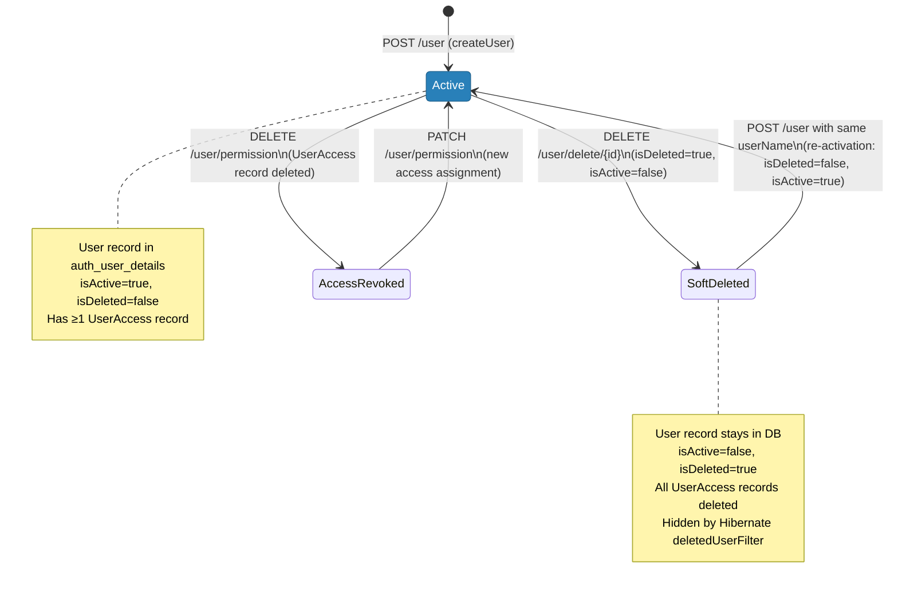
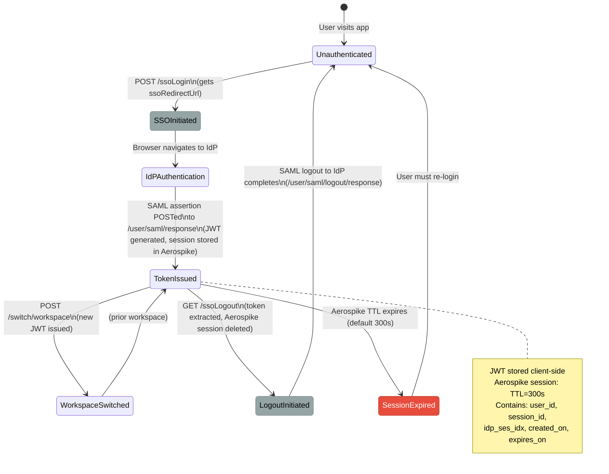
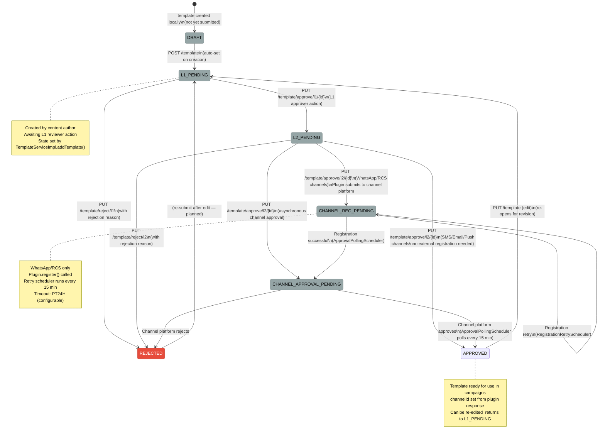
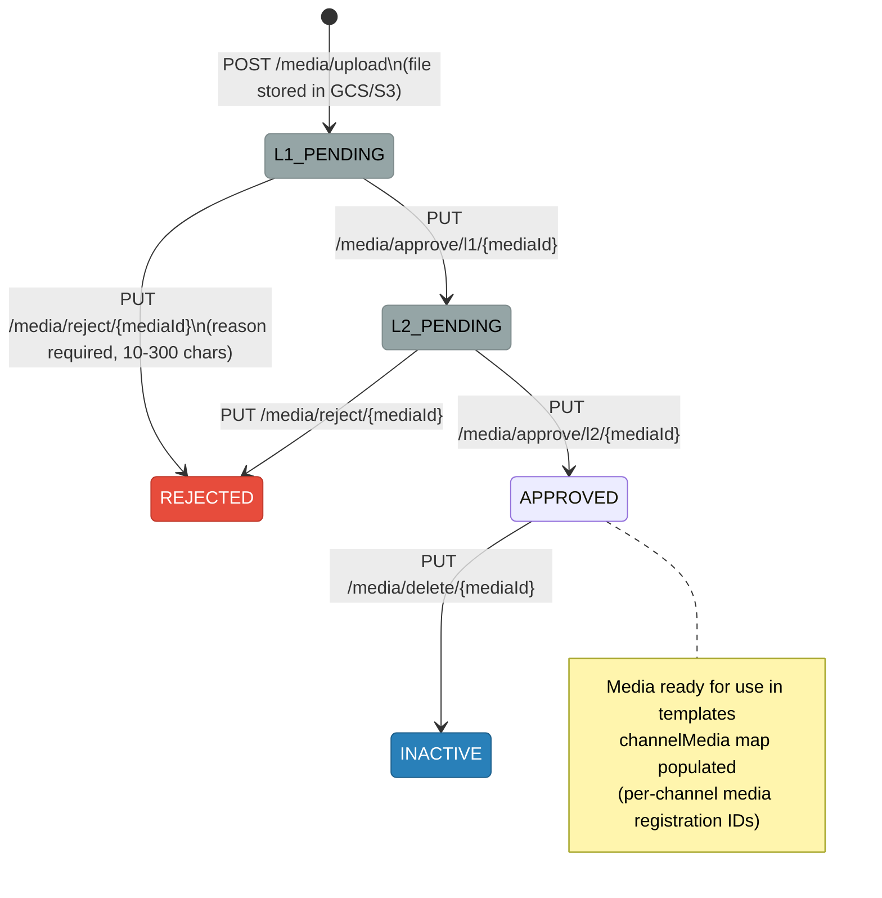

# User Management — State Machines

> Three state machines govern the lifecycle of key domain objects in the user management platform.

---

## 1. User Account State Machine (uclm-auth-manager)

### User State Transitions

| From State | Event | To State | Table / Column |
|-----------|-------|----------|----------------|
| — | `POST /user` | Active | `auth_user_details.is_active=true, is_deleted=false` |
| Active | `DELETE /user/delete/{id}` | SoftDeleted | `is_active=false, is_deleted=true`; all `auth_user_access` rows deleted |
| SoftDeleted | `POST /user` (same username) | Active | `is_active=true, is_deleted=false` (re-activated in-place) |
| Active | `DELETE /user/permission` | AccessRevoked | `auth_user_access` row deleted |
| AccessRevoked | `PATCH /user/permission` | Active | New `auth_user_access` row created |

---

## 2. SSO Session State Machine (uclm-auth-manager)

### JWT Token Claims

| Claim | Key | Type | Value |
|-------|-----|------|-------|
| Subject | `sub` | String | `user.username` (email) |
| User ID | `x-user-id` | String | `user.username` |
| User ID (alt) | `x-usr-id` | String | `user.username` |
| Tenant ID | `x-tenant-id` | String | `user.tenantId` |
| Workspace ID | `x-workspace-id` | String | `userAccess.nodeId` |
| User Hierarchy | `x-user-hierarchy` | String | `"tenantId-parentNodeId-nodeId"` |
| Session ID | `x-session-id` | String | UUID (preserved across workspace switches) |
| Issued At | `iat` | Long | Epoch seconds |
| Expiry | `exp` | Long | `iat + jwt.token.validity ms` (default 360,000 ms = 6 min) |

---

## 3. Template Approval State Machine (uclm-contentmgmt)

### Template State Transitions

| From | Event / Trigger | To | Condition |
|------|----------------|-----|-----------|
| — | `POST /template` | `L1_PENDING` | Always; template created and auto-submitted |
| `L1_PENDING` | `PUT /approve/l1` | `L2_PENDING` | L1 approver approves |
| `L1_PENDING` | `PUT /reject/l1` | `REJECTED` | L1 approver rejects (reason required) |
| `L2_PENDING` | `PUT /approve/l2` | `CHANNEL_REG_PENDING` | WhatsApp/RCS channels with plugin |
| `L2_PENDING` | `PUT /approve/l2` | `APPROVED` | SMS/Email/Push (no external registration) |
| `L2_PENDING` | `PUT /reject/l2` | `REJECTED` | L2 approver rejects (reason required) |
| `CHANNEL_REG_PENDING` | Scheduler: register success | `CHANNEL_APPROVAL_PENDING` | Plugin returns registration ID |
| `CHANNEL_REG_PENDING` | Scheduler: retry (every 15 min) | `CHANNEL_REG_PENDING` | Retry until success or timeout (24h) |
| `CHANNEL_APPROVAL_PENDING` | Scheduler: poll approval | `APPROVED` | Channel platform returns APPROVED status |
| `CHANNEL_APPROVAL_PENDING` | Scheduler: poll rejection | `REJECTED` | Channel platform returns REJECTED status |
| `APPROVED` | `PUT /template` (edit) | `L1_PENDING` | Template edited by author; re-enters review cycle |

---

## 4. Media State Machine (uclm-contentmgmt)

### Media State Transitions

| From | Event | To | Notes |
|------|-------|----|-------|
| — | `POST /media/upload` | `L1_PENDING` | File stored in GCS/S3; metadata in MongoDB |
| `L1_PENDING` | `PUT /approve/l1` | `L2_PENDING` | L1 review pass |
| `L1_PENDING` | `PUT /reject` | `REJECTED` | Reason: 10–300 characters |
| `L2_PENDING` | `PUT /approve/l2` | `APPROVED` | Final approval |
| `L2_PENDING` | `PUT /reject` | `REJECTED` | Reason: 10–300 characters |
| `APPROVED` | `PUT /delete` | `INACTIVE` | Soft deactivation |
