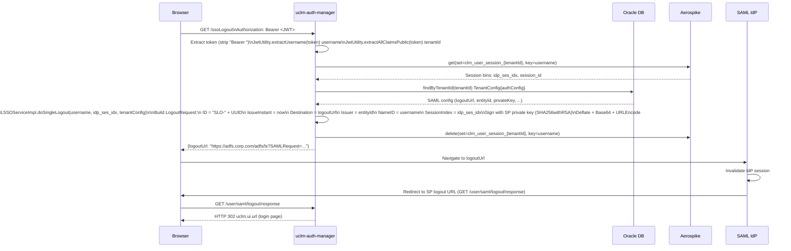

# User Management — SAML 2.0 SSO Flow

> Complete documentation of the SP-Initiated SAML 2.0 Single Sign-On and Single Logout flows implemented in `uclm-auth-manager`.

---

## SAML Architecture Overview

```
┌─────────────────────────────────────────────────────────────────┐
│                    SAML 2.0 SSO Architecture                    │
│                                                                 │
│  ┌─────────┐     ┌──────────────────────┐     ┌─────────────┐  │
│  │ Browser │────▶│  uclm-auth-manager   │────▶│  SAML IdP   │  │
│  │  (UA)   │     │  (Service Provider)  │     │(AD FS/Corp) │  │
│  └─────────┘     └──────────────────────┘     └─────────────┘  │
│       │                    │                         │          │
│       │  1. POST /ssoLogin │                         │          │
│       │───────────────────▶│                         │          │
│       │  2. ssoRedirectUrl │                         │          │
│       │◀───────────────────│                         │          │
│       │  3. Navigate to IdP │                        │          │
│       │────────────────────────────────────────────▶│          │
│       │  4. Login form                               │          │
│       │◀────────────────────────────────────────────│          │
│       │  5. Submit credentials                       │          │
│       │────────────────────────────────────────────▶│          │
│       │  6. POST SAMLResponse to ACS URL             │          │
│       │◀────────────────────────────────────────────│          │
│  POST /user/saml/response                            │          │
│       │───────────────────▶│                         │          │
│       │  7. JWT + redirect │                         │          │
│       │◀───────────────────│                         │          │
└─────────────────────────────────────────────────────────────────┘
```

**SP Entity ID:** Configured per-tenant in `TenantConfig.authConfig.entityId`  
**ACS URL:** `https://<host>/auth-manager/api/v1/user/saml/response`  
**Binding:** HTTP-POST for AuthnRequest (via redirect with deflate+base64), HTTP-POST for SAMLResponse

---

## SP-Initiated SSO — Full Sequence Diagram

```mermaid
sequenceDiagram
    participant Browser
    participant AuthMgr as uclm-auth-manager\n(Service Provider)
    participant Oracle as Oracle DB
    participant IdP as SAML Identity Provider\n(AD FS / Corporate SSO)
    participant Aerospike
    participant FrontendUI as Frontend UI

    Note over Browser,IdP:  Phase 1: SSO Initiation 

    Browser->>AuthMgr: POST /auth-manager/api/v1/ssoLogin\nBody: {userName: "user@corp.com"}\n(No IAM headers needed)

    Note over AuthMgr: AppFilter: path in ignoreIamHeaderApis  skip validation
    AuthMgr->>Oracle: SELECT * FROM auth_user_details WHERE username = 'user@corp.com'
    Oracle-->>AuthMgr: User{userId, tenantId}

    AuthMgr->>Oracle: SELECT * FROM auth_tenant_config WHERE tenant_id = {tenantId}
    Oracle-->>AuthMgr: TenantConfig{authConfig JSON}

    AuthMgr->>AuthMgr: SamlConfigResolver.resolve(tenantId)\nParse authConfig JSON  SamlRuntimeConfig:\n  loginUrl, entityId, acsUrl, certificate,\n  privateKey, slackInSeconds, uiRedirectUrl

    AuthMgr->>AuthMgr: SAMLSSOServiceHelper.generateAuthenticationRequest(config)\n\nOpenSAML: Build AuthnRequest:\n  ID = "AM" + UUID\n  IssueInstant = now(UTC)\n  Version = 2.0\n  Destination = loginUrl\n  AssertionConsumerServiceURL = acsUrl\n  ProtocolBinding = HTTP-POST\n  Issuer = entityId\n  NameIDPolicy format = EMAIL transient=false

    AuthMgr->>AuthMgr: Deflate AuthnRequest XML\n(java.util.zip.Deflater, DEFLATE_MODE)\nBase64 encode (standard)\nURL encode (UTF-8)

    AuthMgr-->>Browser: HTTP 200\n{ssoRedirectUrl: "https://adfs.corp.com/adfs/ls?SAMLRequest=PHNhbWxwO..."}

    Note over Browser,IdP:  Phase 2: Identity Provider Authentication 

    Browser->>IdP: Navigate to ssoRedirectUrl\n(GET https://adfs.corp.com/adfs/ls?SAMLRequest=...)
    IdP->>IdP: Decode + decompress SAMLRequest\nValidate AuthnRequest (issuer, ACS URL, signature if required)
    IdP->>Browser: Render corporate login form
    Browser->>IdP: POST credentials (username + password)
    IdP->>IdP: Authenticate user against Active Directory\nCreate SAML Assertion:\n  Issuer = IdP entity ID\n  Subject = user email\n  Conditions (NotBefore, NotOnOrAfter, AudienceRestriction)\n  Attribute: emailaddress = user@corp.com\n  SessionIndex = idp-session-uuid\nSign Assertion with IdP private key (SHA-256 RSA)

    IdP->>Browser: HTTP POST auto-submit form to ACS URL\n<form action="https://host/auth-manager/api/v1/user/saml/response" method="POST">\n<input name="SAMLResponse" value="base64-encoded-response">\n<input name="RelayState" value="...">

    Note over Browser,Aerospike:  Phase 3: SAML Callback Processing 

    Browser->>AuthMgr: POST /auth-manager/api/v1/user/saml/response\nContent-Type: application/x-www-form-urlencoded\nBody: SAMLResponse=base64...

    Note over AuthMgr: AppFilter: path in ignoreIamHeaderApis  skip validation

    AuthMgr->>AuthMgr: Decode Base64 SAMLResponse\nOpenSAML: unmarshal XML  Response object\nExtract first Assertion

    AuthMgr->>AuthMgr: getEmailFromAssertion(assertion)\nLook for attribute name containing "emailaddress"\n userId = attribute value (user email)

    AuthMgr->>Oracle: SELECT * FROM auth_user_details WHERE username = userId
    Oracle-->>AuthMgr: User{tenantId}

    AuthMgr->>Oracle: SELECT * FROM auth_tenant_config WHERE tenant_id = tenantId
    Oracle-->>AuthMgr: SamlRuntimeConfig

    AuthMgr->>AuthMgr: SAMLResponseValidator.validateSAMLLoginResponse(response, config)\n\nChecks performed:\n  1. Status == urn:...Success\n  2. Signature validation (IdP certificate from config)\n  3. NotBefore ≤ now + slackInSeconds\n  4. now < NotOnOrAfter + slackInSeconds\n  5. AudienceRestriction contains SP entityId or acsUrl

    AuthMgr->>Oracle: SELECT * FROM auth_org_hierarchy WHERE id = user.tenantId\n(root org node = WorkspaceService.getNodeWithoutTenant)
    Oracle-->>AuthMgr: OrgParentHierarchy{id, orgName, orgLevel}

    AuthMgr->>Oracle: SELECT ua.* FROM auth_user_access ua WHERE ua.user_id = user.userId
    Oracle-->>AuthMgr: List<UserAccess> (workspaces + roles)

    AuthMgr->>AuthMgr: sessionId = UUID.randomUUID()\nJwtUtility.generateToken(user, orgNode, accessList, sessionId)\n\nJWT Claims:\n  sub = user.username\n  x-user-id = user.username\n  x-usr-id = user.username\n  x-tenant-id = user.tenantId\n  x-workspace-id = accessList[0].nodeId\n  x-user-hierarchy = tenantId-parentNodeId-workspaceId\n  x-session-id = sessionId\n  exp = now + jwt.token.validity ms

    AuthMgr->>Aerospike: put(namespace=arch, set=clm_user_session_{tenantId}, key=username)\nbins: user_id=username, session_id=sessionId,\n      idp_ses_idx=assertion.sessionIndex,\n      created_on=ISO8601, expires_on=ISO8601\nTTL = session.inactive.interval (300s)

    AuthMgr->>AuthMgr: redirectUrl = config.uiRedirectUrl\n  + "?loginResponse=" + Base64.encode(JWT)

    AuthMgr-->>Browser: HTTP 302 Location: {redirectUrl}

    Note over Browser,FrontendUI:  Phase 4: UI Bootstrap 
    Browser->>FrontendUI: Navigate to redirectUrl (contains JWT)
    FrontendUI->>FrontendUI: Parse base64 JWT from query param\nDecode claims  extract IAM header values\nStore token for subsequent API calls
    FrontendUI-->>Browser: Render authenticated dashboard
```



---

## SAML Single Logout (SLO) Flow



---

## SAML Configuration Reference

All SAML settings are stored per-tenant in `auth_tenant_config.auth_config` JSON:

| Config Key | Type | Description |
|------------|------|-------------|
| `enabled` | Boolean | Whether SAML SSO is enabled for this tenant |
| `loginUrl` | String | IdP SSO endpoint (HTTP-Redirect or HTTP-POST binding) |
| `logoutUrl` | String | IdP SLO endpoint |
| `certificate` | String | IdP signing certificate (X.509, Base64 DER) |
| `entityId` | String | SP entity ID (must match IdP configuration) |
| `acsUrl` | String | Assertion Consumer Service URL |
| `spLoginUrl` | String | SP post-authentication redirect |
| `spLogoutUrl` | String | SP post-logout redirect |
| `uiRedirectUrl` | String | Frontend URL to redirect after JWT issuance |
| `slackInSeconds` | Integer | SAML timing tolerance (default 300 s) |
| `privateKey` | String | SP private key for signing LogoutRequest (PKCS8, Base64) |

---

## OpenSAML Library Usage

| Class | Usage |
|-------|-------|
| `SAMLSSOServiceHelper` | Low-level OpenSAML object builder (AuthnRequest, LogoutRequest/Response) |
| `SAMLResponseValidator` | Response/assertion validation (signature, timing, audience) |
| `SamlConfigResolver` | Resolves `SamlRuntimeConfig` from DB per-tenant |
| `SAMLSSOServiceImpl` | High-level orchestrator using above helpers |
| `UserSSOLoginServiceImpl` | SAML callback processor + JWT issuer |
| `SAMLIdpConfig` / `SAMLSpConfig` | Spring beans for static fallback SAML configuration |

**Library versions:**
- `opensaml` 2.6.4 (legacy API for marshalling/unmarshalling)
- `opensaml-core` 4.0.1 (bootstrap)

---

## Security Considerations

| Concern | Mitigation |
|---------|-----------|
| Replay attacks | SAML assertion `NotBefore`/`NotOnOrAfter` with ±300 s slack |
| Signature forgery | Response/assertion validated against IdP certificate stored in DB |
| Token hijacking | JWT has short expiry (360 s default); scoped to workspace |
| Session fixation | Fresh `sessionId` UUID generated on every SAML login |
| CSRF on ACS | Stateless Spring Security; no CSRF token needed; SP validation covers it |
| Aerospike session | TTL auto-expires sessions; explicit delete on logout |
