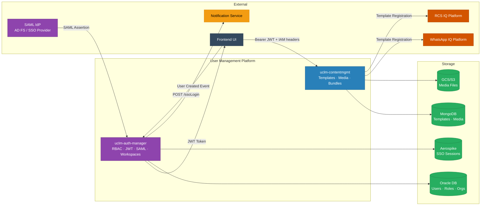

# User Management Platform — High-Level Design (HLD)

> Generated from full source-code analysis of 2 microservices  
> Stack: Java 17 · Spring Boot 3.x · Oracle DB · MongoDB · Aerospike · SAML 2.0 / OpenSAML

---

## Files in This Folder

### System-Level HLD

| File | Description |
|------|-------------|
| `00-services-overview.md` | Both services at a glance — roles, ports, databases, interactions |
| `01-end-to-end-flow.md` | Full flow: user login → token issuance → request authorization → content management |
| `02-rest-api-calls.md` | All REST API endpoints across both services, organized by controller |
| `03-state-machine.md` | User/session state machine, token states, and template approval state machine |
| `04-database-map.md` | Complete database schema for Oracle (auth-manager) and MongoDB (contentmgmt) |
| `05-service-details.md` | Deep technical details per service: algorithms, business rules, key configs |
| `06-saml-sso-flow.md` | Dedicated SAML 2.0 SSO flow doc with SP-initiated sequence diagrams |
| `07-deployment-guide.md` | Deployment guide based on Spring profiles, environment variables, and infra deps |

### Per-Service Detailed HLD

| File | Service |
|------|---------|
| `hld-01-auth-manager.md` | `uclm-auth-manager` — RBAC, JWT, SAML SSO, workspace management |
| `hld-02-contentmgmt.md` | `uclm-contentmgmt` — template lifecycle, media management, approval workflow |

---

## System Overview

The **User Management** platform provides the **identity, access control, and content management layer** for the UCLM (User-Centric Lifecycle Management) ecosystem.

- **uclm-auth-manager**: Authentication gateway. Handles user onboarding, role-based access control (RBAC), SAML 2.0 SSO login, JWT token issuance, workspace switching, and org hierarchy management.
- **uclm-contentmgmt**: Content lifecycle manager. Manages message templates (SMS, Email, WhatsApp, RCS, Push, Voice), media assets, and content bundles through a multi-stage approval workflow.

### Architecture at a Glance

---

## Tech Stack

| Layer | Technology |
|-------|-----------|
| Language | Java 17 |
| Framework | Spring Boot 3.5.x |
| Authentication | SAML 2.0 (OpenSAML 2.6.4 + opensaml-core 4.0.1) |
| Tokens | JWT HS256 (jjwt 0.11.5) |
| Auth DB | Oracle (ojdbc11) / H2 (dev) |
| Session Cache | Aerospike 7.0.0 |
| Content DB | MongoDB (Spring Data MongoDB) |
| Media Storage | GCS (primary) / S3 (alternative) |
| Messaging | Apache Kafka (Kerberos/SASL_PLAINTEXT in prod) |
| Security | Spring Security (stateless, header-based IAM) |
| API Docs | SpringDoc OpenAPI 2.x (Swagger UI) |
| Distributed Lock | ShedLock (content scheduling) |
| Container | Docker · Kubernetes (OCP) |
