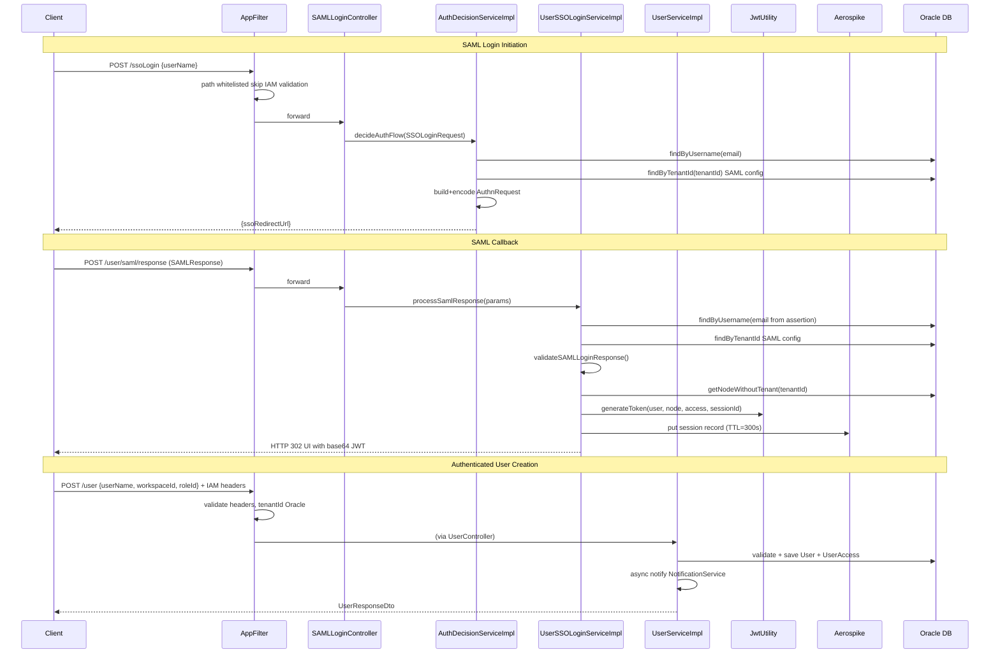

# HLD — uclm-auth-manager

**Role:** RBAC gateway, SAML 2.0 SSO, JWT token issuance, org hierarchy, and user lifecycle management for the UCLM platform.

---

## 1. Purpose & Responsibilities

| Responsibility | Detail |
|---------------|--------|
| User lifecycle | Create, soft-delete, re-activate, paginated list users per tenant/workspace |
| Org / workspace hierarchy | Create tree of org nodes (tenant → region → team), rename nodes |
| Role management | Define named roles, list all roles with endpoint permission mappings |
| Resource & endpoint registry | Register API resources and specific endpoint actions; map to roles |
| SAML 2.0 SSO login | Build SP-Initiated AuthnRequest, receive and validate SAML assertions |
| JWT issuance | Sign HS256 JWTs with IAM claims (tenant, workspace, hierarchy, session) |
| Workspace switching | Re-issue scoped JWT without requiring re-authentication |
| Session management | Store SSO sessions in Aerospike (TTL = 300 s default) |
| Tenant configuration | Store per-tenant SAML config and account settings in Oracle |
| User notifications | Fire async HTTP POST to Notification Service on user creation |
| IAM header enforcement | `AppFilter` validates all requests; enforces tenant isolation |

---

## 2. High-Level Architecture

```
┌────────────────────────────────────────────────────────────────────────────────────┐
│                             uclm-auth-manager                                      │
│                                                                                    │
│  ┌─────────────┐    ┌─────────────────────────────────────────────────────────┐   │
│  │  AppFilter  │    │                 Controller Layer                        │   │
│  │(IAM header  │───▶│  UserCtrl  RoleCtrl  ResourceCtrl  SAMLCtrl  OrgCtrl   │   │
│  │ validation) │    │  TenantCfgCtrl  WorkspaceSwitchCtrl                    │   │
│  └─────────────┘    └──────────────────────────┬────────────────────────────┘   │
│         ▲                                       │                                 │
│         │                                       ▼                                 │
│  ┌──────┴──────┐    ┌─────────────────────────────────────────────────────────┐   │
│  │SecurityConfig│   │                  Service Layer                           │   │
│  │(stateless,  │    │  UserSvc  RoleSvc  ResourceSvc  SAMLSSOSvc             │   │
│  │ permitAll)  │    │  UserSSOLoginSvc  AuthDecisionSvc  WorkspaceSwitchSvc  │   │
│  └─────────────┘    │  WorkspaceSvc  TenantConfigSvc  RoleEndpointSvc        │   │
│                     └──────────────────────────┬────────────────────────────┘   │
│                                                 │                                 │
│  ┌──────────────────────┐   ┌─────────────────────────────────────────────────┐  │
│  │   Cross-Cutting      │   │                 Repositories                    │  │
│  │  JwtUtility (HS256)  │   │  UserRepo  UserAccessRepo  OrgHierarchyRepo    │  │
│  │  SAMLSSOHelper       │   │  RoleRepo  ResourceRepo  RoleEndpointRepo      │  │
│  │  SAMLResponseValidator│  │  TenantConfigRepo  ResourceEndpointRepo        │  │
│  │  SamlConfigResolver  │   └──────────────────────────┬────────────────────┘  │
│  │  SoftDeleteAspect    │                               │                        │
│  │  NotificationClient  │                    ┌──────────┴──────────┐             │
│  └──────────────────────┘                    │    Oracle DB        │ Aerospike   │
└─────────────────────────────────────────────────────────────────────────────────┘
```

---

## 3. Detailed Processing Flow



---

## 4. Key Business Logic

### SAML AuthnRequest Construction
1. Look up user → resolve `tenantId`
2. Load `TenantConfig.authConfig` JSON from Oracle → `SamlRuntimeConfig`
3. Build OpenSAML `AuthnRequest` (UUID ID, IssueInstant, ACS URL, Issuer, NameIDPolicy=EMAIL)
4. Deflate XML → Base64 encode → URL encode → append to `loginUrl?SAMLRequest=...`

### SAML Response Validation
| Check | Implementation |
|-------|---------------|
| SAML Status | Must be `urn:...Success` |
| Signature | Verified against IdP certificate from `TenantConfig.authConfig.certificate` |
| Timing | `NotBefore ≤ now ≤ NotOnOrAfter` ± `slackInSeconds` |
| Audience | Must include SP `entityId` or `acsUrl` |

### JWT Token Claims
```
sub             = user.username (email)
x-user-id       = user.username
x-tenant-id     = user.tenantId
x-workspace-id  = userAccess.nodeId
x-user-hierarchy= tenantId-parentId-workspaceId
x-session-id    = UUID (fresh per login)
exp             = now + 360,000 ms
```
Algorithm: **HS256**, key from `jwt.secret` (Base64 HMAC secret).

### Soft Delete Pattern
- Delete: `is_deleted=true`, `is_active=false`; all `UserAccess` rows deleted
- Re-activation: If `POST /user` with existing (soft-deleted) username → reactivate in-place
- Hibernate filter `deletedUserFilter` applied by `SoftDeleteAspect` AOP on all repo calls

### Org Hierarchy Rules
- Root node: `tenant_id == id` (self-referential)
- Each child inherits root `tenant_id`
- Level calculation: `parentLevel + 1` on creation
- Unique name per parent node (duplicate check before save)

---

## 5. Data Models

### User (`auth_user_details`)
| Field | Type | Notes |
|-------|------|-------|
| `userId` | Long (PK) | Auto-seq `AUTH_USER_DETAILS_SEQUENCE` |
| `username` | String | Email; UNIQUE |
| `isActive` | Boolean | `true` = active |
| `isDeleted` | Boolean | `false` = not deleted (soft delete) |
| `tenantId` | Long | Org root node ID |
| `createdBy/On` | String/Instant | Audit |

### UserAccess (`auth_user_access`)
| Field | Type | Notes |
|-------|------|-------|
| `id` | Long (PK) | Auto-seq |
| `user` | User (FK) | `user_id` |
| `node` | OrgParentHierarchy (FK) | `node_id` = workspace |
| `role` | Role (FK) | `role_id` |
| `tenantId` | Long | Unique constraint: `(user_id, node_id)` |

### Key DTOs
| DTO | Fields | Used By |
|-----|--------|---------|
| `UserRequestDto` | `userName`, `workspaceId`, `roleId` | POST /user |
| `UserResponseDto` | `userId`, `userName`, `isActive`, `tenantId`, `accessInfo[]` | GET /user |
| `JwtResponse` | `accessToken` | POST /switch/workspace |
| `SSOLoginRequest` | `userName` | POST /ssoLogin |
| `AuthDecisionResponse` | `authType`, `ssoType`, `nextStep` (redirect URL) | Internal |

---

## 6. REST API Endpoints

Base path: `/auth-manager/api/v1`

| Method | Path | Auth | Description |
|--------|------|------|-------------|
| POST | `/ssoLogin` | None | Initiate SAML SSO → returns ssoRedirectUrl |
| POST | `/user/saml/response` | None | SAML callback → issues JWT → redirects UI |
| GET | `/ssoLogout` | IAM | Initiate SSO logout |
| GET | `/user/saml/logout/response` | None | SAML SLO callback |
| POST | `/user` | IAM | Create/onboard user |
| GET | `/user` | IAM | Get current user profile |
| PATCH | `/user/permission` | IAM | Update user role/workspace |
| DELETE | `/user/permission` | IAM | Revoke user access |
| DELETE | `/user/delete/{id}` | IAM | Soft-delete user |
| POST | `/tenant/users` | IAM | List users in tenant (paginated) |
| POST | `/workspace/users` | IAM | List users in workspace (paginated) |
| POST | `/switch/workspace` | IAM | Re-issue JWT for new workspace |
| POST | `/org` | IAM | Create org node |
| GET | `/org/{id}` | IAM | Get org node |
| GET | `/org` | IAM | List all org nodes |
| GET | `/org/hierarchy` | IAM | Get full org tree |
| PATCH | `/org/rename` | IAM | Rename org node |
| POST | `/role` | IAM | Create role |
| GET | `/role/{id}` | IAM | Get role + endpoints |
| GET | `/role` | IAM | List all roles |
| GET | `/roles` | IAM | Roles as resource→subModule map |
| POST | `/role/endpoints` | IAM | Map endpoints to role |
| POST | `/resource` | IAM | Create resource |
| POST | `/resource/endpoint` | IAM | Create endpoint under resource |
| GET | `/resource/endpoint/{resourceId}` | IAM | List endpoints for resource |
| GET | `/resource` | IAM | List all resources |
| GET | `/tenant/config/{tenantId}` | None | Get tenant account config |

---

## 7. Security Model

| Layer | Mechanism |
|-------|-----------|
| Transport | HTTPS (TLS termination at load balancer / ingress) |
| Authentication | SAML 2.0 SSO via configured IdP |
| Token | JWT HS256, signed with `jwt.secret`, TTL 360 s |
| Authorization | Header-based IAM (`x-tenant-id`, `x-workspace-id`, `x-user-id`, `x-user-hierarchy`) validated in `AppFilter` |
| Tenant isolation | `tenantId` extracted from headers; all DB queries filter by tenant |
| Session | Aerospike TTL (300 s default); explicit delete on logout |
| SAML security | Assertion signature verified, timing checked, audience validated |
| Spring Security | Stateless, all endpoints permitted (actual auth via `AppFilter`) |
| CSRF | Disabled (stateless tokens; no session cookies) |

---

## 8. Component Map

| Class | Package | Responsibility |
|-------|---------|----------------|
| `AuthManagerApplication` | root | Spring Boot entry point, `@EnableAsync` |
| `AppFilter` | `util` | `OncePerRequestFilter`; IAM header validation + RequestContext |
| `SecurityConfig` | `config` | Stateless Spring Security; disable CSRF; permitAll |
| `WebConfig` | `config` | CORS allowed origins config |
| `JwtUtility` | `util` | HS256 JWT generate + validate |
| `SAMLSSOServiceHelper` | `helper` | OpenSAML object builder; deflate/base64/urlencode |
| `SAMLResponseValidator` | `validation` | SAML response signature + timing + audience validation |
| `SamlConfigResolver` | `service.impl` | Resolves per-tenant SAML config from DB JSON |
| `SSOAuthFactory` | `factory` | Routes SSO type to concrete `SSOService` implementation |
| `AuthDecisionServiceImpl` | `service.impl` | SSO login initiation orchestration |
| `UserSSOLoginServiceImpl` | `service.impl` | SAML callback → JWT → Aerospike session |
| `UserServiceImpl` | `service.impl` | Full user CRUD with RBAC |
| `WorkspaceSwitchServiceImpl` | `service.impl` | JWT re-issuance for workspace switch |
| `WorkspaceServiceImpl` | `service.impl` | Org hierarchy CRUD |
| `RoleServiceImpl` | `service.impl` | Role CRUD + aggregation |
| `RoleEndpointServiceImpl` | `service.impl` | Role ↔ endpoint mapping |
| `ResourceServiceImpl` | `service.impl` | Resource + endpoint registry |
| `TenantConfigServiceImpl` | `service.impl` | Tenant config retrieval |
| `AerospikeConfiguration` | `config` | `IAerospikeClient` bean with optional credentials |
| `DBCredentialsReader` | `config` | Read Aerospike creds from `/opt/getsec_data.txt` |
| `SoftDeleteAspect` | `aop` | Hibernate filter enable/disable AOP |
| `AuthExceptionHandler` | `exception` | `@RestControllerAdvice`; maps exceptions to HTTP codes |
| `CustomResponseBodyAdvice` | `exception` | Wraps all responses in `AppResponse<T>`, adds correlation ID |
| `NotificationServiceClient` | `config` | `@Async` HTTP POST to campaign API on user creation |

---

## 9. Configuration Reference

| Property | Default | Description |
|----------|---------|-------------|
| `server.port` | `${PORT}` | HTTP listen port (required env var) |
| `auth.api.base.url` | `/auth-manager/api/v1` | API base path |
| `jwt.secret` | (Base64 HMAC) | HS256 signing key |
| `jwt.token.validity` | `360000` | Token validity in milliseconds |
| `auth.aerospike.host` | `10.5.247.156:3000` | Aerospike host:port |
| `auth.aerospike.nameSpace` | `arch` | Aerospike namespace |
| `session.inactive.interval` | `300` | Session TTL in seconds |
| `cred.read.path` | `/opt/getsec_data.txt` | Aerospike credential file path |
| `auth.app.allowed.origin` | `https://adtechadrendering.wynk.in,...` | CORS allowed origins |
| `uclm.ui.url` | `https://adtechadrendering.wynk.in/login` | Frontend login redirect URL |
| `notification.api.base-url` | `https://...` | Notification service base URL |
| `notification.api.campaign-id` | `14295` | Notification campaign ID |
| `spring.jpa.hibernate.ddl-auto` | `update` | Schema management strategy |

---

## 10. External Dependencies

| System | Type | Purpose |
|--------|------|---------|
| Oracle DB | Relational DB (JPA/Hibernate) | Persist users, roles, org hierarchy, tenant SAML config |
| Aerospike | NoSQL Cache (spring-data-aerospike) | Store SSO sessions with TTL |
| SAML IdP (AD FS) | SAML 2.0 protocol | Corporate identity provider for authentication |
| Notification Service | REST HTTP (`@Async`) | Alert via campaign API when users are created |
| Frontend UI | HTTP redirect target | Receives JWT after SAML login |
