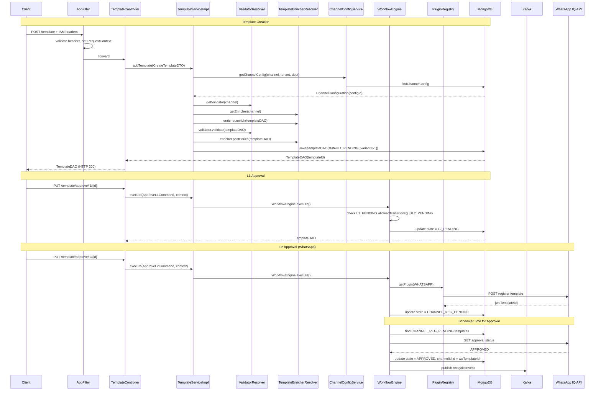

# HLD — uclm-contentmgmt

**Role:** Multi-channel content lifecycle management — templates, media, and bundles with a multi-stage approval workflow and external channel registration.

---

## 1. Purpose & Responsibilities

| Responsibility | Detail |
|---------------|--------|
| Template management | Create and manage message templates for SMS, Email, WhatsApp, RCS, Push, Voice |
| Multi-stage approval | L1 → L2 human approval workflow with rejection/edit cycle |
| Channel registration | Auto-register approved templates to WhatsApp/RCS platforms via plugin system |
| Approval polling | Scheduled polling of external platforms for channel approval status |
| Media management | Upload images/videos/documents to GCS/S3 with L1/L2 approval flow |
| Bundle management | Group multiple templates into reusable bundles |
| Channel configuration | Store per-tenant channel-specific configs (sender IDs, API keys, feature flags) |
| Content validation | Channel-specific validators enforce field constraints and business rules |
| Template enrichment | Channel-specific enrichers normalize and enrich templates before storage |
| Audit logging | Field-level change tracking for all template/media operations |
| Analytics events | Publish lifecycle events to Kafka for analytics pipeline |
| DLT callback | Receive SMS DLT registration callbacks from telco platform |

---

## 2. High-Level Architecture

```
┌────────────────────────────────────────────────────────────────────────────────────┐
│                             uclm-contentmgmt                                       │
│                                                                                    │
│  ┌─────────────┐    ┌────────────────────────────────────────────────────────┐    │
│  │  AppFilter  │    │                Controller Layer                        │    │
│  │(IAM header  │───▶│  TemplateCtrl  MediaCtrl  BundleCtrl  AssetCtrl       │    │
│  │ validation) │    └──────────────────────────┬─────────────────────────────┘    │
│  └─────────────┘                               │                                   │
│                                                ▼                                   │
│  ┌─────────────────────────────────────────────────────────────────────────────┐   │
│  │                          Service Layer                                      │   │
│  │  TemplateServiceImpl  MediaServiceImpl  BundleServiceImpl                  │   │
│  │  ChannelConfigServiceImpl  WorkflowEngine  ValidatorResolver               │   │
│  │  TemplateEnricherResolver  PluginRegistry  ActionRegistry                  │   │
│  └──────────────────────────┬──────────────────────────────────────────────────┘  │
│                              │                                                     │
│  ┌───────────────────────┐   │   ┌─────────────────────────────────────────────┐  │
│  │   Plugin System       │   │   │         Repository Layer                    │  │
│  │  WhatsAppPlugin  ─────┼───┤   │  TemplateRepo  MediaRepo  BundleRepo       │  │
│  │  RcsPlugin        ────┼───┤   │  ConfigRepo  AuditLogRepo                  │  │
│  │  SMSPlugin        ────┼───┘   └─────────────────────────────────────────────┘  │
│  │  EmailPlugin          │                           │                            │
│  │  PushPlugin           │               ┌───────────┼───────────┐               │
│  │  NoOpPlugin           │               │           │           │               │
│  └───────────────────────┘           MongoDB       GCS/S3     Kafka              │
│                                                                                    │
│  ┌──────────────────────────────────────────────────────────────────────────────┐ │
│  │              Schedulers (ShedLock distributed)                               │ │
│  │  ApprovalPollingScheduler  RegistrationRetryScheduler  MediaRegistrationSch  │ │
│  └──────────────────────────────────────────────────────────────────────────────┘ │
└────────────────────────────────────────────────────────────────────────────────────┘
```

---

## 3. Detailed Processing Flow

### Template Creation & Approval Flow



---

## 4. Key Business Logic

### Channel-Specific Validation

| Channel | Validator | Key Checks |
|---------|-----------|-----------|
| `SMS` | `SMSContentValidator` | DLT template ID required, sender length/format, message variable syntax |
| `EMAIL` | `EmailContentValidator` | Subject required, HTML body structure, `fromName` validation |
| `WHATSAPP` | `WhatsAppContentValidator` | Header type constraints, button count/type limits, media presence |
| `RCS` | `RcsContentValidator` | Rich content structure, card layout validation |
| `PUSH` | `PushContentValidator` | Title/body required, deep link format |
| All | `BundleTemplateValidator` | Bundle references valid templateIds; not empty |

### Channel-Specific Enrichment

| Channel | Enricher | What It Does |
|---------|----------|-------------|
| `SMS` | `SMSTemplateEnricher` | Normalizes DLT fields, extracts param names from `{varName}` syntax |
| `EMAIL` | `EmailTemplateEnricher` | Sets MIME type, processes attachment metadata |
| `WHATSAPP` | `WhatsAppTemplateEnricher` | Builds button/header/footer structures, maps media references |
| `RCS` | `RcsTemplateEnricher` | Structures rich card content |
| `PUSH` | `PushTemplateEnricher` | Sets notification channel/priority defaults |
| `BaseTemplateEnricher` | All channels | Sets `templateNameNormalized` (lowercase) for uniqueness checks |

### Workflow State Allowed Transitions

| State | Allowed Transitions |
|-------|-------------------|
| `DRAFT` | `L1_PENDING` |
| `L1_PENDING` | `L2_PENDING`, `REJECTED` |
| `L2_PENDING` | `CHANNEL_REG_PENDING`, `CHANNEL_APPROVAL_PENDING`, `APPROVED`, `REJECTED` |
| `CHANNEL_REG_PENDING` | `CHANNEL_APPROVAL_PENDING` |
| `CHANNEL_APPROVAL_PENDING` | `APPROVED`, `REJECTED` |
| `APPROVED` | `L1_PENDING` (re-edit) |

### Template Edit Business Rule
Editing an `APPROVED` template transitions it back to `L1_PENDING` (edit command), creating a diff log via `DeepDiffUtil`. The edit must produce an actual change (`NoDiffFoundException` if no diff).

### Media Uniqueness
MongoDB compound index: `{mname: 1, tenant: 1, department: 1}` ensures no two media files share the same normalized name in the same tenant+workspace.

### DLT SMS Callback
`POST /template/callback/sms` — exempt from IAM headers. The telco DLT platform POSTs `DLTCallBackResponse` to confirm SMS template registration. `TemplateServiceImpl.handleDLTCallback()` updates template state.

---

## 5. Data Models

### TemplateDAO (MongoDB: `templates`)

| Field | Type | Description |
|-------|------|-------------|
| `templateId` | String | MongoDB ObjectId |
| `templateName` | String | Display name (8–60 chars) |
| `channel` | `Channel` enum | SMS / EMAIL / PUSH / WHATSAPP / RCS / VOICE |
| `language` | String | ENGLISH, HINDI, etc. |
| `templateCategory` | String | TRANSACTIONAL / PROMOTIONAL / OTP |
| `state` | `State` enum | Full lifecycle state |
| `tenant` / `department` | Integer | Tenant + workspace from IAM headers |
| `templateData` | `ChannelTemplate` (polymorphic) | Channel-specific payload |
| `channelId` | `ChannelIdentifier` | Platform registration ID (set on APPROVED) |
| `paramDetails` | `List<ParamDetail>` | Template variable definitions |

### MediaDAO (MongoDB: `media`)

| Field | Type | Description |
|-------|------|-------------|
| `mediaId` | String | MongoDB ObjectId |
| `mediaUrl` | String | CDN-accessible URL |
| `channels` | `List<Channel>` | Approved for channels |
| `state` | `State` | L1_PENDING → APPROVED / INACTIVE |
| `checksum` | String | Deduplication checksum |
| `channelMedia` | `Map<Channel, MediaChannelInfo>` | Per-channel registration IDs |

### BundleDAO (MongoDB: `bundles`)

| Field | Type | Description |
|-------|------|-------------|
| `bundleId` | String | MongoDB ObjectId |
| `bundleName` | String | Display name |
| `templates` | `Set<BundleTemplate>` | Template references (NOT EMPTY) |
| `templateDetails` | `List<TemplateDAO>` | Populated on read |

---

## 6. REST API Endpoints

Base path: `/content-manager/api/v1`

| Method | Path | Auth | Description |
|--------|------|------|-------------|
| POST | `/template` | IAM | Create template → L1_PENDING |
| GET | `/template/{id}` | IAM | Get template by ID |
| GET | `/templates/l1_pending` | IAM | List L1_PENDING templates (paginated) |
| GET | `/templates/l2_pending` | IAM | List L2_PENDING templates (paginated) |
| POST | `/filter/template` | IAM | Filter templates by state/channel/name |
| PUT | `/template/approve/l1/{id}` | IAM | Approve at L1 |
| PUT | `/template/approve/l2/{id}` | IAM | Approve at L2 |
| PUT | `/template/reject/l1` | IAM | Reject at L1 (reason required) |
| PUT | `/template/reject/l2` | IAM | Reject at L2 (reason required) |
| PUT | `/template` | IAM | Edit approved template |
| POST | `/template/callback/sms` | **None** | DLT SMS registration callback |
| POST | `/media/upload` | IAM | Upload media file (multipart) |
| GET | `/media/{mediaId}` | IAM | Get media by ID |
| POST | `/media/filter` | IAM | Filter media assets |
| PUT | `/media/approve/l1/{mediaId}` | IAM | Approve media at L1 |
| PUT | `/media/approve/l2/{mediaId}` | IAM | Approve media at L2 |
| PUT | `/media/reject/{mediaId}` | IAM | Reject media (reason 10–300 chars) |
| PUT | `/media/delete/{mediaId}` | IAM | Deactivate media |
| PUT | `/media` | IAM | Update media metadata |
| POST | `/bundle` | IAM | Create bundle |
| GET | `/bundle/{id}` | IAM | Get bundle by ID |
| POST | `/bundle/filter` | IAM | Filter bundles |
| PATCH | `/bundle` | IAM | Update bundle |
| GET | `/assets` | IAM | Get channel config `?channel=SMS` |
| GET | `/assets/tenant` | IAM | Get all channel configs for tenant |

---

## 7. Security Model

| Layer | Mechanism |
|-------|-----------|
| Authentication | JWT-derived IAM headers validated by `AppFilter` |
| Tenant isolation | All MongoDB queries include `tenant` field filter from `RequestContext` |
| Dept isolation | All queries include `department` field filter from `RequestContext` |
| DLT callback | Whitelisted from IAM (`/template/callback/sms`) — verified by content |
| File upload size | Max 101 MB per file, 111 MB total request |
| Distributed scheduling | ShedLock prevents concurrent scheduler execution across pods |
| Kafka security | Kerberos SASL_PLAINTEXT with keytab auth in UAT/Prod |

---

## 8. Component Map

| Class | Package | Responsibility |
|-------|---------|----------------|
| `ContentManagerApplication` | root | Spring Boot entry point |
| `AppFilter` | `config` | IAM header validation, RequestContext population |
| `SecurityConfig` | `config` | Stateless Spring Security, permitAll |
| `TemplateController` | `controller` | Template CRUD + approval endpoints |
| `MediaController` | `controller` | Media upload + lifecycle endpoints |
| `BundleController` | `controller` | Bundle CRUD endpoints |
| `AssetController` | `controller` | Channel config read endpoints |
| `TemplateServiceImpl` | `service.impl` | Template lifecycle orchestration |
| `MediaServiceImpl` | `service.impl` | Media upload + state transitions |
| `BundleServiceImpl` | `service.impl` | Bundle CRUD |
| `ChannelConfigServiceImpl` | `service.impl` | Channel configuration retrieval |
| `WorkflowEngine` | `service` | Drives state machine transitions via commands |
| `StateRegistry` | `workflow.state` | Maps `State` enum → `WorkflowState` bean |
| `ValidatorResolver` | `service` | Maps `Channel` → `ContentValidator` |
| `TemplateEnricherResolver` | `enricher` | Maps `Channel` → `TemplateEnricher` |
| `PluginRegistry` | `service` | Maps `Channel` → `ChannelPlugin` |
| `ActionRegistry` | `service` | Maps action type → `WorkflowAction` |
| `GCSFileService` | `service.impl` | Upload files to Google Cloud Storage |
| `S3FileService` | `service.impl` | Upload files to AWS S3 / MinIO |
| `WhatsAppPlugin` | `plugin` | Register/poll templates via WhatsApp IQ API |
| `RcsPlugin` | `plugin` | Register/poll templates via RCS IQ API |
| `ApprovalPollingScheduler` | `scheduler` | Poll channel platforms every 15 min (ShedLock) |
| `RegistrationRetryScheduler` | `scheduler` | Retry failed registrations every 15 min (ShedLock) |
| `MediaRegistrationScheduler` | `scheduler` | Register pending media every 30 sec (ShedLock) |
| `AuditHandler` | `audit.handler` | Persist field-level diffs to `audit_log` |
| `AnalyticsKafkaHandler` | `analytics.handler` | Publish lifecycle events to Kafka |
| `DeepDiffUtil` | `util.diff` | Compute field-level diffs between entity versions |
| `MvelTemplateFieldSetter` | `util` | MVEL expression evaluation for dynamic field setting |
| `GlobalExceptionHandler` | `exception` | `@RestControllerAdvice` exception → HTTP status mapping |
| `CustomResponseBodyAdvice` | `config` | Wrap responses in standard envelope |

---

## 9. Configuration Reference

| Property | Default | Description |
|----------|---------|-------------|
| `server.port` | `${PORT}` | HTTP listen port |
| `content.api.base.url` | `/content-manager/api/v1` | API base path |
| `uclm.file.service.provider` | `GCS` | File storage: `GCS`, `S3`, `S3_PRESIGNED` |
| `uclm.gcs.bucket.name` | `airtel-uclm-mediacdn` | GCS bucket name |
| `uclm.cdn.url` | `https://uclm-mcdn-preprod.wynk.in/` | CDN prefix for media URLs |
| `approval.poll.cron` | `0 */15 * * * *` | Approval polling frequency |
| `rcs.template.approval.timeout` | `PT24H` | RCS approval timeout duration |
| `registration.retry.cron` | `0 */15 * * * *` | Registration retry frequency |
| `media.registration.cron` | `0,30 * * ? * *` | Media registration check frequency |
| `approval.polling.batch-size` | `500` | Max templates per polling run |
| `registration.retry.batch-size` | `250` | Max retries per scheduler run |
| `kafka.kerberos.enabled` | `true` | Toggle Kerberos auth for Kafka |
| `content.bundle.enable.variant` | `false` | Enable bundle variant feature |
| `iq.whatsapp.base.url` | `https://iqconversation.airtel.in/...` | WhatsApp IQ API base URL |

---

## 10. External Dependencies

| System | Type | Purpose |
|--------|------|---------|
| MongoDB | NoSQL DB (Spring Data MongoDB) | Persist templates, media, bundles, channel configs, audit logs |
| GCS (Google Cloud Storage) | Object storage | Store uploaded media files (primary) |
| AWS S3 / MinIO | Object storage | Store uploaded media files (alternative) |
| WhatsApp IQ Platform | REST HTTP | Register WhatsApp templates and poll for approval |
| RCS IQ Platform | REST HTTP | Register RCS templates and poll for approval |
| Apache Kafka | Messaging (Kerberos SASL) | Publish analytics and change events |
| SAML IdP (via auth-manager) | Indirect (IAM headers) | User identity context passed via headers |
